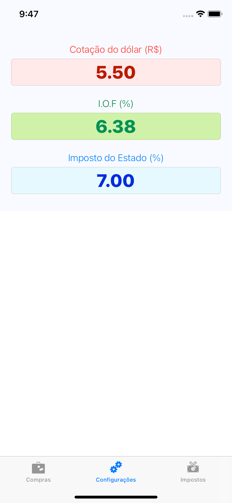

# ComprasUSA
> Aplicativo para desenvolvimento Swift/iOS

Aplicativo para calcular a conversão do câmbio Dólar/Real e taxações.

## Conceitos abordados

* Linguagem
    * Swift 5.4

* Auto Layout
    * Constraint
    * Autoresizing 
    * Assets
        * Assets diferentes por device
    * Size Classes
        * Modos de exibição Landscape e Portrait com elementos, tamanho de fontes e componentes UI diferentes

* UI Components
    * UIView
    * UIImage
    * UILabel
    * UITextField
    * UITabBar
    * UIStackView
    * UISwitch

* Singleton
    * Variáveis
    * Variáveis computadas
    * Funções
    * NumberFormatter
    * Extension

* Delegates
    * UITextFieldDelegate

## Snapshots

* Portrait

* Landscape

